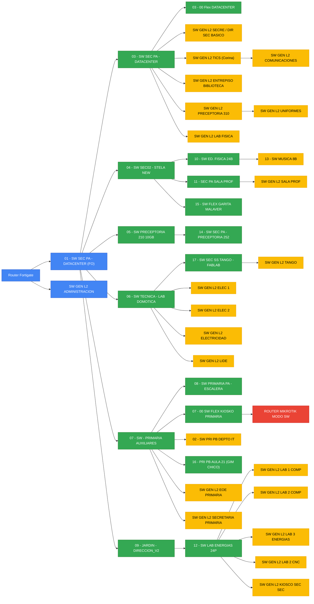

```mermaid
flowchart LR
    classDef core fill:#4285F4,stroke:#2A56C6,color:white;
    classDef distribucion fill:#34A853,stroke:#2E7D32,color:white;
    classDef acceso fill:#FBBC05,stroke:#E8A203,color:black;
    classDef especial fill:#EA4335,stroke:#C62828,color:white;

    RF[Router Fortigate] --> C01["01 - SW SEC PA - DATACENTER (FO)"]
    RF --> S02["SW GEN L2 ADMINISTRACION"]
    C01 --> S03["03 - SW SEC PA - DATACENTER"]
    S03 --> F03["03 - 00 Flex DATACENTER"]
    S03 --> S031["SW GEN L2 SECRE / DIR SEC BASICO"]
    S03 --> S032["SW GEN L2 TICS (Corina)"]
    S032 --> S036["SW GEN L2 COMUNICACIONES"]
    S03 --> S033["SW GEN L2 ENTREPISO BIBLIOTECA"]
    S03 --> S034["SW GEN L2 PRECEPTORIA 310"]
    S034 --> S037["SW GEN L2 UNIFORMES"]
    S03 --> S035["SW GEN L2 LAB FISICA"]

    C01 --> S04["04 - SW SEC02 - STELA NEW"]
    S04 --> E10["10 - SW ED. FISICA 24B"]
    E10 --> M13["13 - SW MUSICA 8B"]
    S04 --> P11["11 - SEC PA SALA PROF"]
    P11 --> SPROF["SW GEN L2 SALA PROF"]
    S04 --> FLEX2["15 - SW FLEX GARITA MALAVER"]

    C01 --> S05["05 - SW PRECEPTORIA 210 10GB"]
    S05 --> P14["14 - SW SEC PA - PRECEPTORIA 252"]

    C01 --> S06["06 - SW TECNICA - LAB DOMOTICA"]
    S06 --> T17["17 - SW SEC SS TANGO - FABLAB"]
    T17 --> TANGO["SW GEN L2 TANGO"]
    S06 --> ELEC1["SW GEN L2 ELEC 1"]
    S06 --> ELEC2["SW GEN L2 ELEC 2"]
    S06 --> ELEC3["SW GEN L2 ELECTRICIDAD"]
    S06 --> LIDE["SW GEN L2 LIDE"]

    C01 --> S07["07 - SW - PRIMARIA AUXILIARES"]
    S07 --> P08["08 - SW PRIMARIA PA - ESCALERA"]
    S07 --> K07["07 - 00 SW FLEX KIOSKO PRIMARIA"]
    K07 --> RMIK["ROUTER MIKROTIK MODO SW"]
    S07 --> D02["02 - SW PRI PB DEPTO IT"]
    S07 --> G16["16 - PRI PB AULA 21 (GIM CHICO)"]
    S07 --> EOE["SW GEN L2 EOE PRIMARIA"]
    S07 --> SPRI["SW GEN L2 SECRETARIA PRIMARIA"]

    C01 --> S09["09 - JARDIN - DIRECCION_V2"]
    S09 --> L12["12 - SW LAB ENERGIAS 24P"]
    L12 --> LC1["SW GEN L2 LAB 1 COMP"]
    L12 --> LC2["SW GEN L2 LAB 2 COMP"]
    L12 --> LE3["SW GEN L2 LAB 3 ENERGIAS"]
    L12 --> CNC["SW GEN L2 LAB 2 CNC"]
    L12 --> KSEC["SW GEN L2 KIOSCO SEC SEC"]

    class RF,C01,S02 core;
    class S03,S04,S05,S06,S07,S09,F03,FLEX1,FLEX2,P11,E10,P14,T17,P08,K07,G16,L12 distribucion;
    class S031,S032,S033,S034,S035,S036,S037,,M13,SPROF,TANGO,ELEC1,ELEC2,ELEC3,LIDE,D02,EOE,SPRI,LC1,LC2,LE3,CNC,KSEC acceso;
    class RMIK especial;
```
