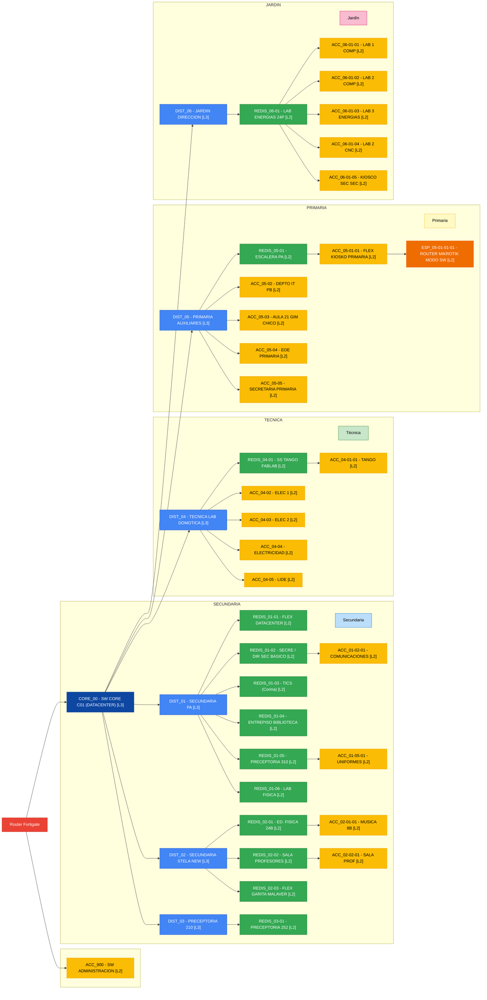

```mermaid
flowchart LR

%% Estilos generales
classDef enrutamiento fill:#EA4335,stroke:#C62828,color:white;
classDef core fill:#0D47A1,stroke:#0B3C91,color:white;
classDef distribucion fill:#4285F4,stroke:#2A56C6,color:white;
classDef redistribucion fill:#34A853,stroke:#2E7D32,color:white;
classDef acceso fill:#FBBC05,stroke:#E8A203,color:black;
classDef especial fill:#EF6C00,stroke:#E65100,color:white;

%% Estilos de sector
classDef secundaria fill:#BBDEFB,stroke:#1976D2,color:#000;
classDef tecnica fill:#C8E6C9,stroke:#388E3C,color:#000;
classDef primaria fill:#FFF9C4,stroke:#FBC02D,color:#000;
classDef jardin fill:#F8BBD0,stroke:#D81B60,color:#000;

%% Nodo inicial
RF[Router Fortigate]:::enrutamiento --> CORE_00["CORE_00 - SW CORE C01 (DATACENTER) [L3]"]:::core

%% ADMIN
subgraph admin_space [ ]
direction TB
    ACC_900["ACC_900 - SW ADMINISTRACION [L2]"]:::acceso
end
RF --> ACC_900

%% SECTOR SECUNDARIA
subgraph SECUNDARIA
direction TB
    SEC_LABEL[Secundaria]:::secundaria

    CORE_00 --> DIST_01["DIST_01 - SECUNDARIA PA [L3]"]:::distribucion
    DIST_01 --> REDIS_01-01["REDIS_01-01 - FLEX DATACENTER [L2]"]:::redistribucion
    DIST_01 --> REDIS_01-02["REDIS_01-02 - SECRE / DIR SEC BASICO [L2]"]:::redistribucion
    REDIS_01-02 --> ACC_01-02-01["ACC_01-02-01 - COMUNICACIONES [L2]"]:::acceso
    DIST_01 --> REDIS_01-03["REDIS_01-03 - TICS (Corina) [L2]"]:::redistribucion
    DIST_01 --> REDIS_01-04["REDIS_01-04 - ENTREPISO BIBLIOTECA [L2]"]:::redistribucion
    DIST_01 --> REDIS_01-05["REDIS_01-05 - PRECEPTORIA 310 [L2]"]:::redistribucion
    REDIS_01-05 --> ACC_01-05-01["ACC_01-05-01 - UNIFORMES [L2]"]:::acceso
    DIST_01 --> REDIS_01-06["REDIS_01-06 - LAB FISICA [L2]"]:::redistribucion

    CORE_00 --> DIST_02["DIST_02 - SECUNDARIA STELA NEW [L3]"]:::distribucion
    DIST_02 --> REDIS_02-01["REDIS_02-01 - ED. FISICA 24B [L2]"]:::redistribucion
    REDIS_02-01 --> ACC_02-01-01["ACC_02-01-01 - MUSICA 8B [L2]"]:::acceso
    DIST_02 --> REDIS_02-02["REDIS_02-02 - SALA PROFESORES [L2]"]:::redistribucion
    REDIS_02-02 --> ACC_02-02-01["ACC_02-02-01 - SALA PROF [L2]"]:::acceso
    DIST_02 --> REDIS_02-03["REDIS_02-03 - FLEX GARITA MALAVER [L2]"]:::redistribucion

    CORE_00 --> DIST_03["DIST_03 - PRECEPTORIA 210 [L3]"]:::distribucion
    DIST_03 --> REDIS_03-01["REDIS_03-01 - PRECEPTORIA 252 [L2]"]:::redistribucion
end

%% SECTOR TECNICA
subgraph TECNICA
direction TB
    TEC_LABEL[Técnica]:::tecnica

    CORE_00 --> DIST_04["DIST_04 - TECNICA LAB DOMOTICA [L3]"]:::distribucion
    DIST_04 --> REDIS_04-01["REDIS_04-01 - SS TANGO FABLAB [L2]"]:::redistribucion
    REDIS_04-01 --> ACC_04-01-01["ACC_04-01-01 - TANGO [L2]"]:::acceso
    DIST_04 --> ACC_04-02["ACC_04-02 - ELEC 1 [L2]"]:::acceso
    DIST_04 --> ACC_04-03["ACC_04-03 - ELEC 2 [L2]"]:::acceso
    DIST_04 --> ACC_04-04["ACC_04-04 - ELECTRICIDAD [L2]"]:::acceso
    DIST_04 --> ACC_04-05["ACC_04-05 - LIDE [L2]"]:::acceso
end

%% SECTOR PRIMARIA
subgraph PRIMARIA
direction TB
    PRI_LABEL[Primaria]:::primaria

    CORE_00 --> DIST_05["DIST_05 - PRIMARIA AUXILIARES [L3]"]:::distribucion
    DIST_05 --> REDIS_05-01["REDIS_05-01 - ESCALERA PA [L2]"]:::redistribucion
    REDIS_05-01 --> ACC_05-01-01["ACC_05-01-01 - FLEX KIOSKO PRIMARIA [L2]"]:::acceso
    ACC_05-01-01 --> ESP_05-01-01-01["ESP_05-01-01-01 - ROUTER MIKROTIK MODO SW [L2]"]:::especial
    DIST_05 --> ACC_05-02["ACC_05-02 - DEPTO IT PB [L2]"]:::acceso
    DIST_05 --> ACC_05-03["ACC_05-03 - AULA 21 GIM CHICO [L2]"]:::acceso
    DIST_05 --> ACC_05-04["ACC_05-04 - EOE PRIMARIA [L2]"]:::acceso
    DIST_05 --> ACC_05-05["ACC_05-05 - SECRETARIA PRIMARIA [L2]"]:::acceso
end

%% SECTOR JARDÍN
subgraph JARDIN
direction TB
    JAR_LABEL[Jardín]:::jardin

    CORE_00 --> DIST_06["DIST_06 - JARDIN DIRECCION [L3]"]:::distribucion
    DIST_06 --> REDIS_06-01["REDIS_06-01 - LAB ENERGIAS 24P [L2]"]:::redistribucion
    REDIS_06-01 --> ACC_06-01-01["ACC_06-01-01 - LAB 1 COMP [L2]"]:::acceso
    REDIS_06-01 --> ACC_06-01-02["ACC_06-01-02 - LAB 2 COMP [L2]"]:::acceso
    REDIS_06-01 --> ACC_06-01-03["ACC_06-01-03 - LAB 3 ENERGIAS [L2]"]:::acceso
    REDIS_06-01 --> ACC_06-01-04["ACC_06-01-04 - LAB 2 CNC [L2]"]:::acceso
    REDIS_06-01 --> ACC_06-01-05["ACC_06-01-05 - KIOSCO SEC SEC [L2]"]:::acceso
end

```
